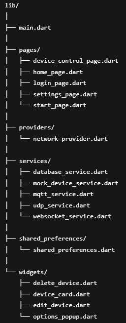

# 🧠 Smart Device Control App – Internship Project @ Emtantra

This Flutter app allows users to configure, control, and monitor smart devices (like ESP32/ESP8266) over both **local Wi-Fi (WebSocket & UDP)** and **cloud (future MQTT)**. Designed for flexibility, it supports both **real device communication** and **mock simulations** for development and testing.

---

## 🚀 Features

- ✅ **User Authentication**
  - Admin credentials stored in SQLite
  - SharedPreferences used for session management
  - Login & logout functionality

- ⚙️ **Add New Device (Mock & Real ESP Flow)**
  - Mock ESP32 service to simulate full device onboarding
  - Device name, SSID, and password input with validation
  - Auto-generated device names (e.g., *Device 1*, *Device 2*, etc.)
  - Simulated WebSocket config exchange + UDP discovery
  - SQLite used to store and retrieve devices

- 📶 **Real-Time Device Control**
  - Toggle device state from Control Page
  - Real-time updates on Home Page using state management
  - Renaming devices syncs across screens

- 📱 **Responsive UI**
  - Home Page with device cards
  - Device Control Page styled to match Home Page
  - Dialogs with form validation, network prompts, and loading indicators
  - Smooth transitions and error handling

---

## 🏗️ Project Structure

---

## 🧪 Testing & Mock Setup

This project supports **full mock simulation** for device testing without hardware.

1. Start app and login with admin credentials.
2. Click "Add Device" → guided dialog prompts for:
   - Connect to mock ESP Wi-Fi (`ET-XXXX`)
   - Enter SSID, password, and name
3. Config sent to `mock_device_service.dart` via WebSocket
4. Device appears on Home Page via UDP simulation
5. Toggle and rename tested in real-time with shared state sync

---

## 🧠 Built With

- Flutter
- SQLite (via `sqflite`)
- WebSocket (`web_socket_channel`)
- UDP (`udp`)
- MQTT (future integration via `mqtt_client`)
- SharedPreferences

---

